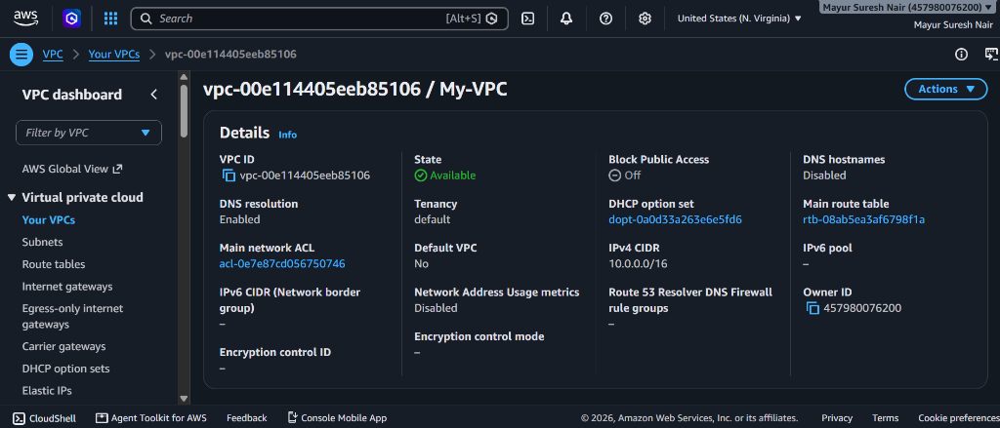
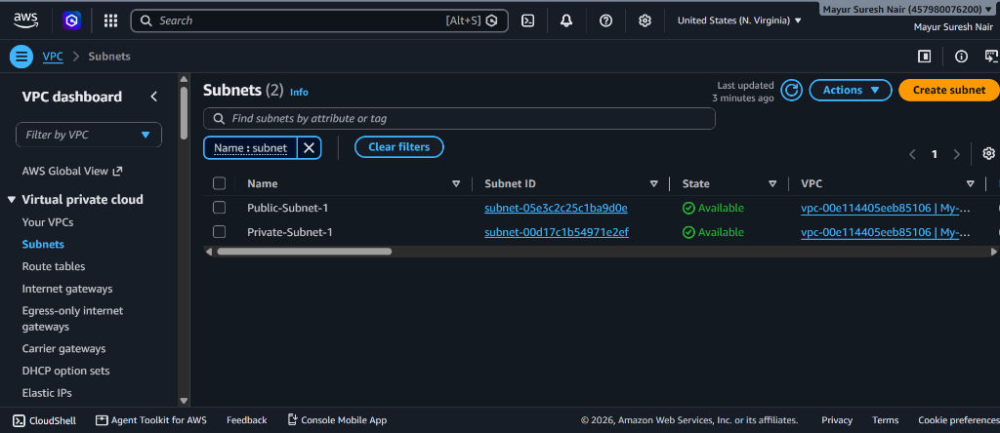
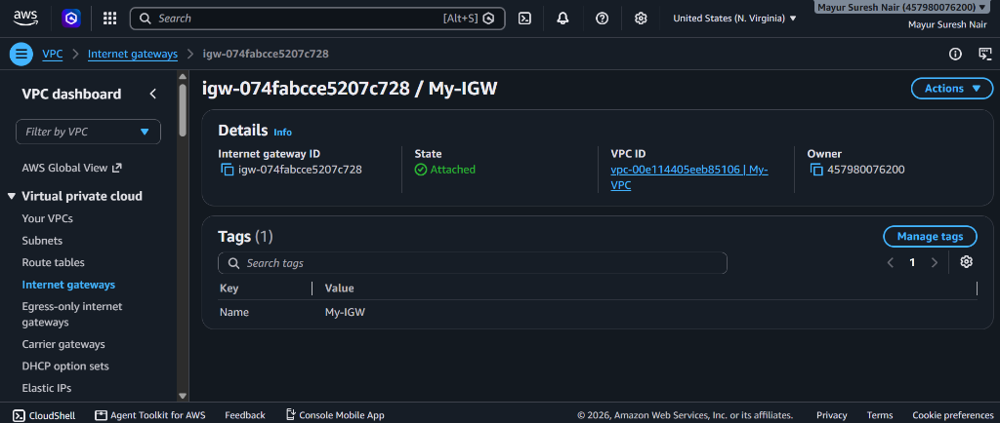
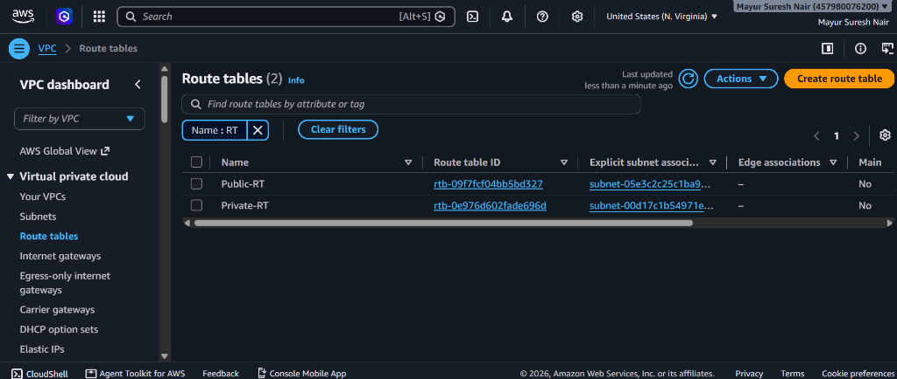
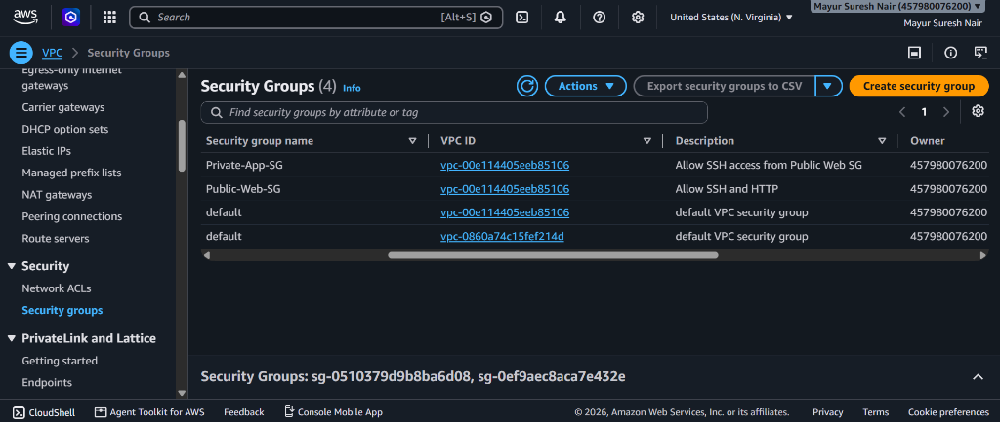
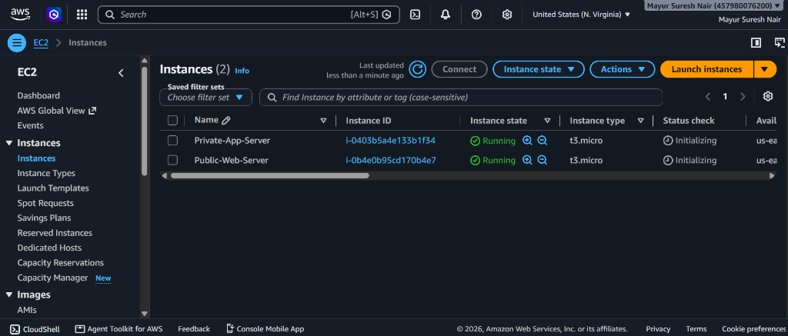
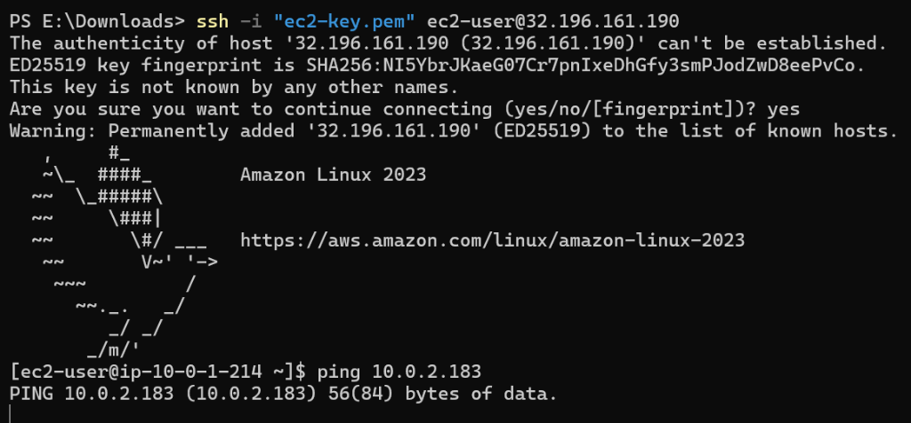

# AWS VPC Setup - Public & Private Subnets with EC2 Instances

> A hands-on AWS networking project that demonstrates how to architect a secure, production-ready Virtual Private Cloud (VPC) with public and private subnets, EC2 instances, routing, and security group rules.

---

## Table of Contents

- [Project Overview](#project-overview)
- [Architecture](#architecture)
- [AWS Resources Created](#aws-resources-created)
- [Step-by-Step Setup](#step-by-step-setup)
  - [Step 1: Create the VPC](#step-1-create-the-vpc)
  - [Step 2: Create Subnets](#step-2-create-subnets)
  - [Step 3: Create and Attach Internet Gateway](#step-3-create-and-attach-internet-gateway)
  - [Step 4: Configure Route Tables](#step-4-configure-route-tables)
  - [Step 5: Create Security Groups](#step-5-create-security-groups)
  - [Step 6: Launch EC2 Instances](#step-6-launch-ec2-instances)
- [Security Group Rules](#security-group-rules)
- [Demo Screenshots](#demo-screenshots)
- [Key Concepts Explained](#key-concepts-explained)
- [Traffic Flow](#traffic-flow)
- [Cleanup](#cleanup)
- [Proof of Working Setup](#proof-of-working-setup)
- [References](#references)

---

## Project Overview

This project sets up a complete AWS networking environment using a **Virtual Private Cloud (VPC)**. The architecture separates resources into:

- A **Public Subnet** - hosting a web server (EC2) reachable from the internet
- A **Private Subnet** - hosting an application/database server (EC2) accessible only from the public subnet

This mirrors real-world production setups where your web-facing layer is public, while your backend/database tier is kept private and secure.

---

## Architecture

```
                         +--------------------------------------------------+
                         |            AWS Region (us-east-1)                 |
                         |                                                    |
                         |   +------------------------------------------+   |
                         |   |          My-VPC  (10.0.0.0/16)           |   |
                         |   |                                           |   |
  Internet  ---------->  IGW |  +--------------+  +----------------+    |   |
                         |   |  | Public Subnet|  | Private Subnet |    |   |
                         |   |  | 10.0.1.0/24  |  | 10.0.2.0/24   |    |   |
                         |   |  |              |  |                |    |   |
                         |   |  | +----------+ |  | +------------+ |    |   |
                         |   |  | | Web-EC2  |-+--+->| App-EC2   | |    |   |
                         |   |  | | (Public) | |  | | (Private)  | |    |   |
                         |   |  | +----------+ |  | +------------+ |    |   |
                         |   |  | Public-RT    |  | Private-RT     |    |   |
                         |   |  | Public-Web-SG|  | Private-App-SG |    |   |
                         |   |  +--------------+  +----------------+    |   |
                         |   +------------------------------------------+   |
                         +--------------------------------------------------+
```

---

## AWS Resources Created

| Resource | Name | Details |
|---|---|---|
| VPC | My-VPC | CIDR: 10.0.0.0/16 |
| Public Subnet | Public-Subnet-1 | CIDR: 10.0.1.0/24, Auto-assign Public IP: ON |
| Private Subnet | Private-Subnet-1 | CIDR: 10.0.2.0/24, Auto-assign Public IP: OFF |
| Internet Gateway | My-IGW | Attached to My-VPC |
| Route Table (Public) | Public-RT | Routes 0.0.0.0/0 to IGW |
| Route Table (Private) | Private-RT | Local traffic only |
| Security Group (Public) | Public-Web-SG | Allow SSH (22) + HTTP (80) |
| Security Group (Private) | Private-App-SG | Allow SSH from Public-Web-SG only |
| EC2 Instance (Public) | Public-Web-Server | Amazon Linux 2023, t3.micro |
| EC2 Instance (Private) | Private-App-Server | Amazon Linux 2023, t3.micro |

---

## Step-by-Step Setup

### Step 1: Create the VPC

1. Go to **AWS Console > VPC > Your VPCs > Create VPC**
2. Set the following:
   - **Name tag:** My-VPC
   - **IPv4 CIDR block:** 10.0.0.0/16
   - **Tenancy:** Default
3. Click **Create VPC**

> VPC ID created: `vpc-00e114405eeb85106`

---

### Step 2: Create Subnets

#### 2a. Public Subnet

1. Go to **VPC > Subnets > Create Subnet**
2. Select your VPC: My-VPC
3. Configure:
   - **Name:** Public-Subnet-1
   - **Availability Zone:** us-east-1a
   - **IPv4 CIDR:** 10.0.1.0/24
4. After creation: **Actions > Edit subnet settings > Enable auto-assign public IPv4**

#### 2b. Private Subnet

1. Create another subnet in the same VPC:
   - **Name:** Private-Subnet-1
   - **Availability Zone:** us-east-1b
   - **IPv4 CIDR:** 10.0.2.0/24
2. Leave auto-assign public IP **disabled**

---

### Step 3: Create and Attach Internet Gateway

1. Go to **VPC > Internet Gateways > Create Internet Gateway**
2. Name: My-IGW
3. Click **Create**, then **Actions > Attach to VPC > My-VPC**

> IGW ID: `igw-074fabcce5207c728` - State: **Attached**

---

### Step 4: Configure Route Tables

#### 4a. Public Route Table

1. Go to **VPC > Route Tables > Create Route Table**
   - **Name:** Public-RT
   - **VPC:** My-VPC
2. Select Public-RT > **Routes tab > Edit routes > Add route:**
   - **Destination:** 0.0.0.0/0
   - **Target:** My-IGW (Internet Gateway)
3. Go to **Subnet Associations > Edit > Associate Public-Subnet-1**

#### 4b. Private Route Table

1. Create another Route Table:
   - **Name:** Private-RT
   - **VPC:** My-VPC
2. Leave routes as local only (no internet route)
3. Associate with Private-Subnet-1

---

### Step 5: Create Security Groups

#### 5a. Public-Web-SG (for Web Server)

Go to **VPC > Security Groups > Create security group**
- **Name:** Public-Web-SG
- **Description:** Allow SSH and HTTP
- **VPC:** My-VPC

**Inbound Rules:**

| Type | Protocol | Port | Source | Purpose |
|------|----------|------|--------|---------|
| SSH | TCP | 22 | 0.0.0.0/0 | Remote access |
| HTTP | TCP | 80 | 0.0.0.0/0 | Web traffic |

**Outbound Rules:**

| Type | Protocol | Port | Destination |
|------|----------|------|-------------|
| All traffic | All | All | 0.0.0.0/0 |

#### 5b. Private-App-SG (for App Server)

- **Name:** Private-App-SG
- **Description:** Allow SSH access from Public Web SG
- **VPC:** My-VPC

**Inbound Rules:**

| Type | Protocol | Port | Source | Purpose |
|------|----------|------|--------|---------|
| SSH | TCP | 22 | Public-Web-SG | Bastion access from web server only |

**Outbound Rules:**

| Type | Protocol | Port | Destination |
|------|----------|------|-------------|
| All traffic | All | All | 0.0.0.0/0 |

> The private instance is ONLY accessible from the public web server - never directly from the internet.

---

### Step 6: Launch EC2 Instances

#### 6a. Web Server (Public Subnet)

- **Name:** Public-Web-Server
- **AMI:** Amazon Linux 2023
- **Instance type:** t3.micro (free tier eligible)
- **Network:** My-VPC
- **Subnet:** Public-Subnet-1
- **Auto-assign public IP:** Enable
- **Security Group:** Public-Web-SG

#### 6b. App Server (Private Subnet)

- **Name:** Private-App-Server
- **AMI:** Amazon Linux 2023
- **Instance type:** t3.micro
- **Network:** My-VPC
- **Subnet:** Private-Subnet-1
- **Auto-assign public IP:** Disable
- **Security Group:** Private-App-SG

---

## Demo Screenshots

### 1. VPC Created - My-VPC (10.0.0.0/16)


### 2. Subnets - Public-Subnet-1 and Private-Subnet-1


### 3. Internet Gateway - My-IGW (Attached)


### 4. Route Tables - Public-RT and Private-RT


### 5. Security Groups - Public-Web-SG and Private-App-SG


---

## Key Concepts Explained

| Concept | Explanation |
|---|---|
| VPC | A logically isolated virtual network in AWS that you define |
| Subnet | A range of IP addresses within your VPC; can be public or private |
| Internet Gateway (IGW) | Allows communication between your VPC and the internet |
| Route Table | Rules that determine where network traffic is directed |
| Security Group | Acts as a virtual firewall for EC2 instances (stateful) |
| Public Subnet | Subnet with a route to the IGW; instances can be internet-facing |
| Private Subnet | No route to IGW; instances are isolated from direct internet access |
| Bastion Host | A public EC2 used to securely SSH into private EC2 instances |

---

## Traffic Flow

```
User (Internet)
      |
      v
Internet Gateway (My-IGW)
      |
      v
Public-RT --> Public-Subnet-1
      |
      v
Public-Web-Server EC2  [Port 22 SSH + Port 80 HTTP open]
      |
      |  SSH Jump (Bastion Host pattern)
      v
Private-Subnet-1 (Private-RT - local only, no IGW route)
      |
      v
Private-App-Server EC2  [SSH from Public-Web-SG only]
```

---

## Cleanup

To avoid AWS charges, delete resources in this order:

1. **Terminate** EC2 instances (Public-Web-Server, Private-App-Server)
2. **Delete** Security Groups (Private-App-SG, Public-Web-SG)
3. **Detach and Delete** Internet Gateway (My-IGW)
4. **Delete** Route Tables (Public-RT, Private-RT)
5. **Delete** Subnets (Public-Subnet-1, Private-Subnet-1)
6. **Delete** VPC (My-VPC)

---

## Proof of Working Setup

### EC2 Instances - Both Running

Both `Private-App-Server` and `Public-Web-Server` EC2 instances are confirmed **Running** (t3.micro) inside the VPC.



---

### SSH into Public EC2 + Ping Private EC2

Successfully SSH'd into the **Public-Web-Server** (`32.196.161.190`) using the `.pem` key, then pinged the **Private-App-Server** at `10.0.2.183` - confirming private subnet connectivity from the bastion host.

```bash
ssh -i "ec2-key.pem" ec2-user@32.196.161.190
# Connected to Amazon Linux 2023

[ec2-user@ip-10-0-1-214 ~]$ ping 10.0.2.183
# PING 10.0.2.183 (10.0.2.183) 56(84) bytes of data.
```



> The private server (`10.0.2.183`) is **only reachable from inside the VPC** - not from the public internet. This confirms the security group and subnet routing is working correctly.

---

## References

- [AWS VPC Documentation](https://docs.aws.amazon.com/vpc/latest/userguide/what-is-amazon-vpc.html)
- [Amazon EC2 Documentation](https://docs.aws.amazon.com/ec2/index.html)
- [AWS Security Groups](https://docs.aws.amazon.com/vpc/latest/userguide/vpc-security-groups.html)
- [AWS Route Tables](https://docs.aws.amazon.com/vpc/latest/userguide/VPC_Route_Tables.html)

---

> If this project helped you, please give it a star on GitHub!